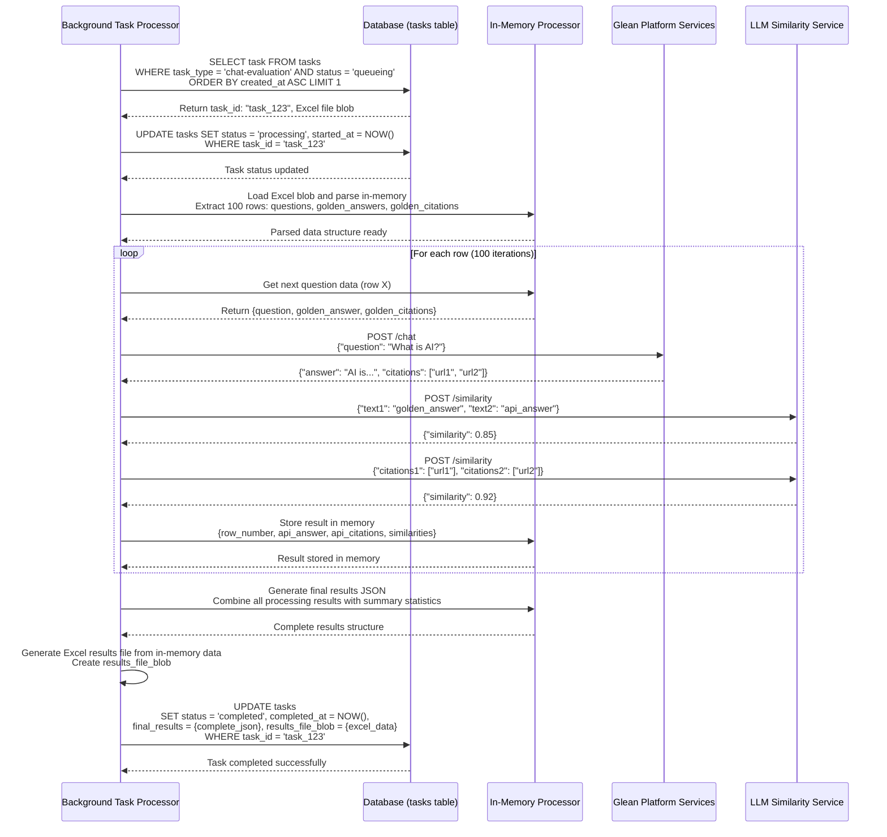
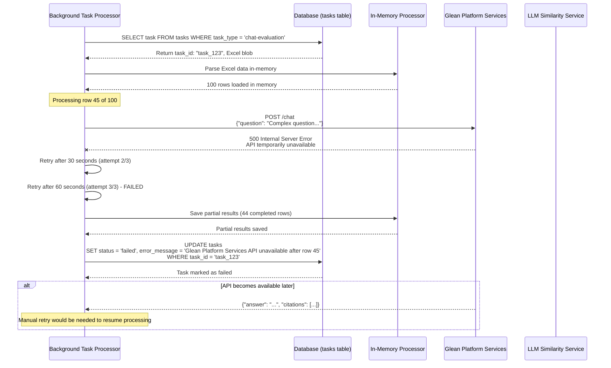

# Chat Evaluation Background Processing Sequence Diagram - Version 2

## Chat Evaluation Processing Flow (In-Memory)

### Success Flow - Complete Excel Processing (In-Memory)


### Error Flow - API Failure During Processing (In-Memory)


## Processing Characteristics

### Performance Metrics
- **Processing Rate**: ~15-20 rows per minute (depending on API response times)
- **Memory Usage**: Entire Excel dataset loaded in memory for processing
- **Error Handling**: 3 retry attempts with exponential backoff
- **Transaction Safety**: Single atomic update with complete results

### Data Flow Summary
1. **Task Selection**: FIFO queue processing of chat-evaluation tasks
2. **In-Memory Loading**: Load entire Excel file into memory structures
3. **Sequential Processing**: Process each row with API calls
4. **Memory Accumulation**: Store all results in memory during processing
5. **Final Assembly**: Generate complete results JSON and Excel file
6. **Atomic Completion**: Single database update with all final data

### Memory Management
- **Structured Data**: Organized in-memory data structures for processing
- **Result Accumulation**: Build complete results during processing
- **Memory Cleanup**: Automatic cleanup after task completion
- **Large File Handling**: Chunked processing for very large Excel files

### Error Recovery
- **API Failures**: Retry with exponential backoff, save partial results on failure
- **Memory Errors**: Graceful handling of memory limitations
- **Partial Processing**: Save partial results for manual retry/resume
- **Data Integrity**: Complete results or failure, no partial database states
- **API Call Pattern**: 2 external API calls per row (Glean Platform Services + LLM Similarity)

### Results Storage Format
```json
{
  "total_questions": 100,
  "processed_questions": 100,
  "processing_time_ms": 450000,
  "average_answer_similarity": 0.85,
  "average_citation_similarity": 0.92,
  "results": [
    {
      "row_number": 1,
      "question": "What is AI?",
      "golden_answer": "AI is artificial intelligence...",
      "api_answer": "AI refers to artificial intelligence...",
      "answer_similarity": 0.85,
      "citation_similarity": 0.92,
      "processing_time_ms": 1250
    }
  ],
  "summary": {
    "high_similarity_count": 75,
    "medium_similarity_count": 20,
    "low_similarity_count": 5
  }
}
``` 