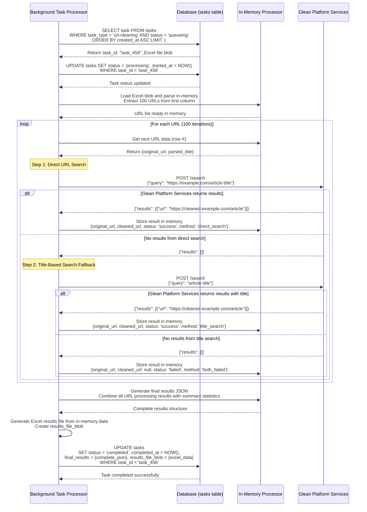
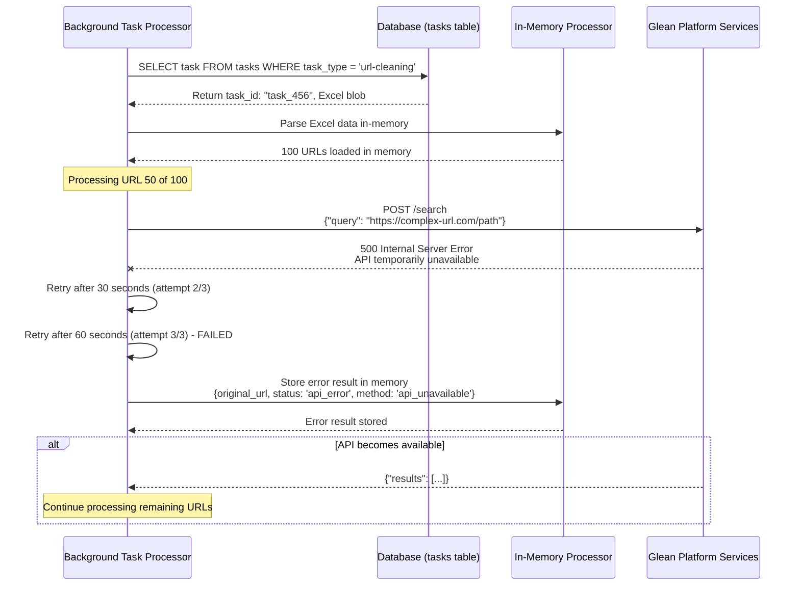
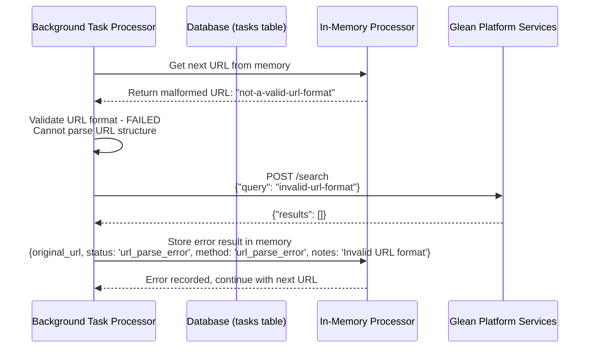

# URL Cleaning Background Processing Sequence Diagram - Version 2

## URL Cleaning Processing Flow (In-Memory)

### Success Flow - Complete URL Processing (In-Memory)


### Glean Platform Services API Failure (In-Memory)


### URL Parsing Error (In-Memory)


## Processing Characteristics

### Performance Metrics
- **Processing Rate**: ~25-35 URLs per minute (depending on Glean Platform Services response times)
- **Memory Usage**: Entire URL dataset loaded in memory for processing
- **Error Handling**: 3 retry attempts with exponential backoff for API failures
- **Success Rate**: ~70-80% URLs successfully cleaned (depends on data quality)
- **API Call Pattern**: 1-2 Glean Platform Services calls per URL (direct search + optional title search)

### Data Flow Summary
1. **Task Selection**: FIFO queue processing of url-cleaning tasks
2. **In-Memory Loading**: Load entire Excel file into memory structures
3. **Sequential Processing**: Process each URL with search API calls
4. **Two-Step Search**: Direct URL search followed by title-based search fallback
5. **Memory Accumulation**: Store all results in memory during processing
6. **Final Assembly**: Generate complete results JSON and Excel file
7. **Atomic Completion**: Single database update with all final data

### Memory Management
- **Structured Data**: Organized in-memory data structures for URL processing
- **Result Accumulation**: Build complete results during processing
- **Memory Cleanup**: Automatic cleanup after task completion
- **Large File Handling**: Chunked processing for very large URL lists

### Error Recovery
- **API Failures**: Retry with exponential backoff, record as 'api_error' if all retries fail
- **URL Parse Errors**: Record as 'url_parse_error' and continue processing
- **Memory Errors**: Graceful handling of memory limitations
- **Partial Processing**: Save partial results for manual retry/resume
- **Data Integrity**: Complete results or failure, no partial database states
- **Fallback Strategy**: Two-step search process (direct URL → title extraction)

### Results Storage Format
```json
{
  "total_urls": 100,
  "processed_urls": 100,
  "processing_time_ms": 180000,
  "success_count": 80,
  "failed_count": 20,
  "results": [
    {
      "row_number": 1,
      "original_url": "https://example.com/old-article",
      "cleaned_url": "https://example.com/article",
      "status": "success",
      "method": "direct_search",
      "processing_time_ms": 500
    },
    {
      "row_number": 2,
      "original_url": "https://broken-link.com/page",
      "cleaned_url": null,
      "status": "failed",
      "method": "both_failed",
      "processing_time_ms": 2000
    }
  ],
  "summary": {
    "direct_search_success": 60,
    "title_search_success": 20,
    "api_failures": 15,
    "parse_errors": 5
  }
}
``` 