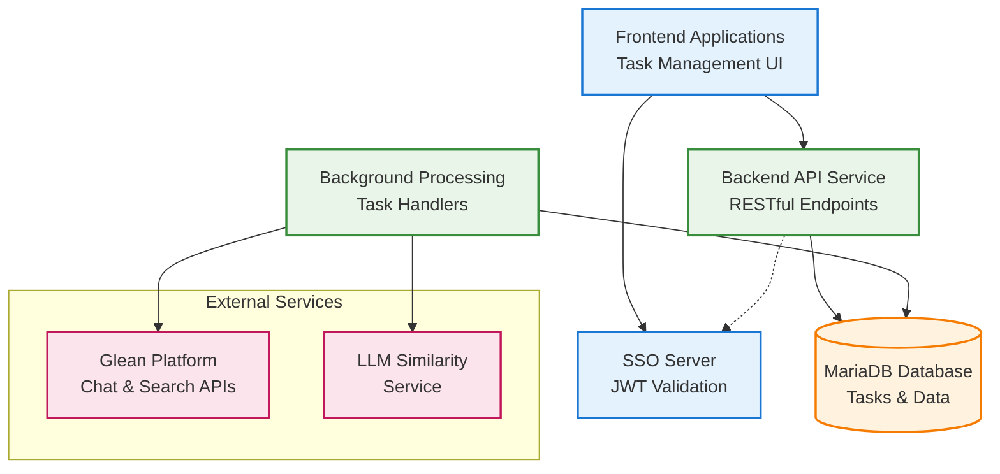
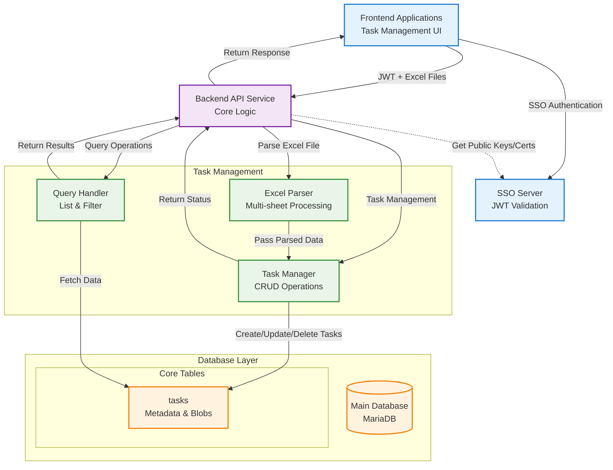
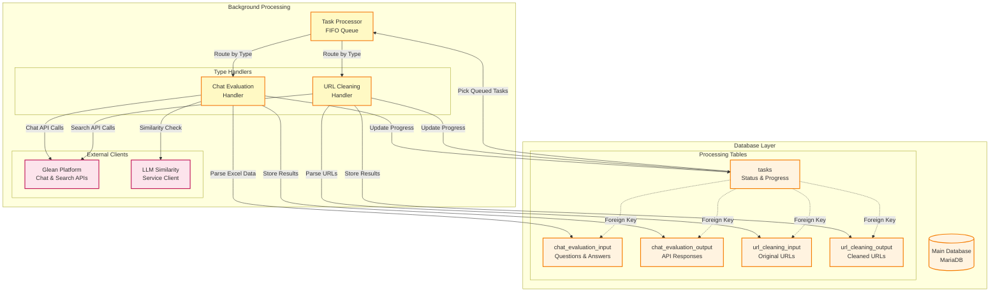

# Internal Task Management API Solution Design

## Project Overview
**Internal Task Management API for [Organization Name]**

This is an internal API service designed for task management within our organization. The service allows users to submit tasks by uploading Excel files, where each sheet becomes a separate task. The API handles all file processing internally without requiring external downstream services.

**Key Characteristics:**
- Internal organizational use only
- JWT-based authentication from frontend applications
- Excel file upload and processing (multi-sheet support)
- Task lifecycle management (create, query, cancel, delete)
- Self-contained service with internal file processing

**Core Functionality:**
- **File Upload**: Users upload Excel files with multiple sheets
- **Task Creation**: Each sheet is converted to a separate task with file stored as blob
- **Task Management**: Users can query, cancel, and delete their tasks
- **File Processing**: Backend splits Excel files and stores individual sheet data internally

## System Architecture

### High-Level Architecture


### Service Responsibilities
- **Frontend Applications**: 
  - User interface for task management
  - File upload and task monitoring
  - JWT token handling and SSO integration
- **SSO Server**:
  - Single Sign-On authentication
  - JWT token issuance and validation
  - Public key/certificate distribution via JWKS endpoint
- **Backend API Service**: 
  - RESTful API endpoints
  - Local JWT token validation using SSO public keys
  - Excel file upload and processing (parsing, sheet extraction)
  - Task lifecycle management (CRUD operations)
  - File blob storage and retrieval
  - Response formatting and error handling
- **Background Processing Engine**:
  - FIFO queue management
  - Task type routing (Chat Evaluation, URL Cleaning)
  - External service integration
  - Progress tracking and status updates
- **External Services**:
  - Glean Platform Services for chat evaluation and URL search
  - LLM Similarity Service for response comparison
- **MariaDB Database**: 
  - Task metadata and status storage
  - User ownership and permissions
  - File blob storage for individual sheets
  - Processing data for chat evaluation and URL cleaning
  - Task history and audit information

## System Components and Data Flow

### Task Submission, Query & Management Flow Chart


### Background Processing Flow Chart


### Component Responsibilities Summary

| Component | Primary Responsibility | Key Relations |
|-----------|----------------------|---------------|
| **Frontend Applications** | User interface, file upload, task management | → Backend API Service (via JWT) |
| **SSO Server** | Single Sign-On authentication, JWT token issuance and validation | → Backend API Service |
| **Backend API Service** | RESTful endpoints, JWT validation, request/response handling | → Task Management, Database |
| **Excel File Parser** | Multi-sheet parsing, blob creation, data validation | → Task Manager |
| **Task Manager** | Task CRUD operations, status updates, lifecycle management | → Database |
| **Query Handler** | Task listing, filtering, search operations | → Database |
| **Background Task Processor** | FIFO queue management, task type routing | → Task Handlers |
| **Task Type Handlers** | Business logic for each task type (2 types) | → External APIs, Database |
| **Database Tables** | Data persistence, blob storage, relationships | ← All Components |
| **External Service Clients** | API integration with Glean Platform Services and LLM Similarity Service | ← Task Handlers |

### Data Flow Patterns

#### **User-Facing Operations:**
1. **Upload Flow**: UI → Backend API → File Parser → Task Manager → Database (tasks table)
2. **Query Flow**: UI → Backend API → Query Handler → Database → Response
3. **Management Flow**: UI → Backend API → Task Manager → Database → Response

#### **Background Operations:**
4. **Processing Flow**: Database (tasks) → Task Processor → Type Handlers → External APIs → Database (input/output tables)
5. **Status Update Flow**: Task Handlers → Database (tasks) → Progress Updates

## Authentication & Authorization

### JWT Token Flow
- Frontend applications obtain JWT tokens from our internal SSO server
- Each API request includes JWT token in Authorization header: `Bearer <token>`
- **Key Distribution**: Backend API Service obtains public keys from SSO server at startup and periodically refreshes them
- **Token Validation**: API validates JWT signature locally using SSO public keys (no SSO server call per request)
- **User Context**: API extracts user context (user_id, roles, permissions) from validated JWT claims
- User context is used for task ownership and access control

## API Endpoints Design

### Endpoint Overview

| Method | Endpoint | Description | Auth Level |
|--------|----------|-------------|------------|
| POST   | `/rest/v1/tasks` | Upload Excel file and create tasks | User |
| GET    | `/rest/v1/tasks` | List user's tasks with filtering (no blob data) | User |
| GET    | `/rest/v1/tasks/{id}` | Get specific task details with blob files | User |
| PUT    | `/rest/v1/tasks/{id}` | Update/cancel a task | Owner |
| DELETE | `/rest/v1/tasks/{id}` | Delete a task | Owner |

## Database Design

### Task Table Schema
```sql
CREATE TABLE tasks (
    id UUID PRIMARY KEY DEFAULT gen_random_uuid(),
    user_id VARCHAR(255) NOT NULL,
    original_filename VARCHAR(500) NOT NULL,
    sheet_name VARCHAR(255) NOT NULL,
    task_file_blob BYTEA NOT NULL,
    task_file_size BIGINT NOT NULL,
    results_file_blob BYTEA,
    results_file_size BIGINT,
    file_mime_type VARCHAR(100) DEFAULT 'application/vnd.openxmlformats-officedocument.spreadsheetml.sheet',
    task_status VARCHAR(50) NOT NULL DEFAULT 'pending',
    upload_batch_id UUID NOT NULL,
    created_at TIMESTAMP WITH TIME ZONE DEFAULT NOW(),
    updated_at TIMESTAMP WITH TIME ZONE DEFAULT NOW(),
    started_at TIMESTAMP WITH TIME ZONE,
    completed_at TIMESTAMP WITH TIME ZONE,
    cancelled_at TIMESTAMP WITH TIME ZONE,
    error_message TEXT,
    progress_percentage INTEGER DEFAULT 0,
    metadata JSONB,
    created_by VARCHAR(255) NOT NULL,
    
    CONSTRAINT valid_status CHECK (task_status IN ('pending', 'processing', 'completed', 'cancelled', 'failed')),
    CONSTRAINT valid_progress CHECK (progress_percentage >= 0 AND progress_percentage <= 100)
);

-- Indexes for performance
CREATE INDEX idx_tasks_user_id ON tasks(user_id);
CREATE INDEX idx_tasks_status ON tasks(task_status);
CREATE INDEX idx_tasks_upload_batch ON tasks(upload_batch_id);
CREATE INDEX idx_tasks_created_at ON tasks(created_at DESC);
CREATE INDEX idx_tasks_user_status ON tasks(user_id, task_status);
```

### Task Status Flow
- **queueing**: Task created, waiting for processing
- **processing**: Task is being executed
- **completed**: Task finished successfully
- **cancelled**: Task cancelled by user
- **failed**: Task failed with error

## Sequence Diagrams

The complete system architecture and data flow patterns are documented in the **System Components and Data Flow** section above, which includes:

- **Task Submission, Query & Management Flow Chart** - Shows user-facing operations including file upload, task management, and query operations
- **Background Processing Flow Chart** - Shows asynchronous processing including task handlers, external service integrations, and database operations
- **Component Responsibilities Summary** - Details the role and relationships of each system component
- **Data Flow Patterns** - Documents the five key data flow patterns for both user-facing and background operations

For detailed API endpoint sequence diagrams and request/response flows, refer to the separate **sequence-diagrams-api-handling.md** documentation.

## Error Handling Strategy

### Standard Error Response Format
```json
{
  "error": {
    "code": "ERROR_CODE",
    "message": "Human readable message",
    "details": "Additional context",
    "timestamp": "2024-01-01T00:00:00Z",
    "trace_id": "request_uuid",
    "user_id": "extracted_from_jwt"
  }
}
```

### Error Scenarios
- **Invalid Excel File**: Return 400 with file format validation errors
- **File Size Limit Exceeded**: Return 413 with size limit information
- **Task Not Found**: Return 404 for non-existent or unauthorized tasks
- **Excel Parsing Failure**: Return 500 with processing error details
- **Database Connection Issues**: Return 500 with appropriate error message

## Performance Considerations

### File Upload Optimization
- **Streaming Upload**: Process large Excel files without loading entirely in memory
- **Async Processing**: Background task processing for sheet extraction
- **Progress Tracking**: Real-time updates on file processing status
- **Chunk Processing**: Handle large sheets in chunks

### Scalability Plans
- Horizontal scaling with stateless API instances
- Database connection pooling and read replicas
- File storage optimization with blob compression
- Background job queues for task processing

## Security Considerations

### Authentication & Authorization
- **SSO Integration**: Centralized authentication through Single Sign-On server
- **JWT Token Validation**: Cryptographic validation using public keys from SSO server
- **User Context Extraction**: Secure extraction of user identity and permissions
- **Access Control**: Task ownership validation for all operations
- **Request Logging**: Complete audit trail for security compliance

### Data Encryption
- **Data at Rest**: 
  - Database-level encryption for sensitive tables and columns
  - File blob encryption using AES-256-GCM encryption
  - Encrypted storage of Excel files and processing results
  - Key management through external key management service
- **Data in Transit**:
  - TLS 1.3 encryption for all API communications
  - Encrypted connections to external services (Glean, LLM)
  - Secure database connections with SSL/TLS
- **Field-Level Encryption**:
  - Sensitive data fields encrypted using Jasypt Spring Boot integration
  - Transparent encryption/decryption at application level
  - Hierarchical key structure with automatic rotation
  - Support for user-level and task-level encryption keys

### File Security
- **File Validation**: Strict Excel format validation and virus scanning
- **Size Limits**: Maximum file size and sheet count restrictions
- **User Isolation**: Users can only access their own tasks and files
- **Secure Storage**: Encrypted file blob storage with access controls

### Data Protection
- **PII Handling**: Secure processing of data within Excel files
- **Access Control**: Task ownership validation for all operations
- **Request Logging**: Complete audit trail for security compliance
- **Network Security**: Internal service communication over encrypted channels
- **Data Retention**: Configurable data retention policies with secure deletion
- **Compliance**: GDPR, SOX, and industry-standard compliance measures

## Next Steps
1. [ ] Define specific Excel file validation rules
2. [ ] Implement file parsing logic within the main API service
3. [ ] Create detailed sequence diagrams for each endpoint
4. [ ] Write complete OpenAPI specification with file upload
5. [ ] Define task processing workflows and error handling
6. [ ] Set up monitoring and logging for the service
7. [ ] Design user interface for task management 