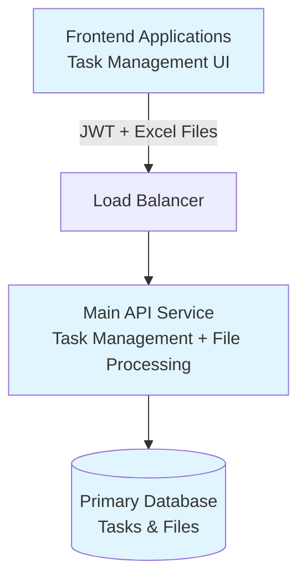
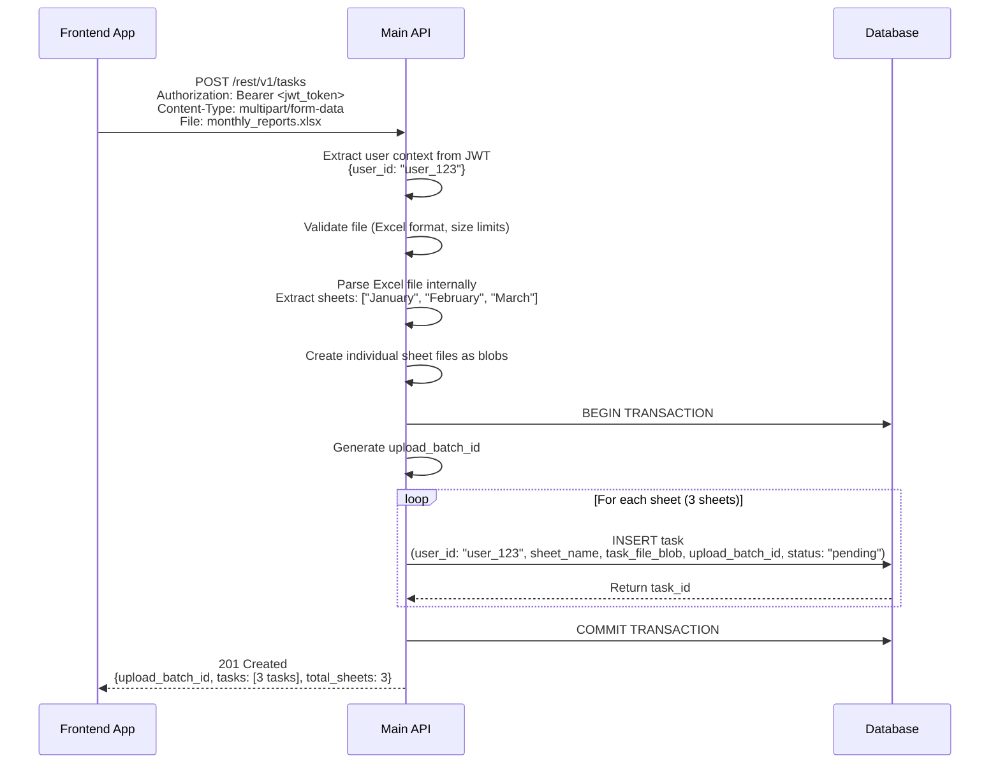

# Internal Task Management API Solution Design

## Project Overview
**Internal Task Management API for [Organization Name]**

This is an internal API service designed for task management within our organization. The service allows users to submit tasks by uploading Excel files, where each sheet becomes a separate task. The API handles all file processing internally without requiring external downstream services.

**Key Characteristics:**
- Internal organizational use only
- JWT-based authentication from frontend applications
- Excel file upload and processing (multi-sheet support)
- Task lifecycle management (create, query, cancel, delete)
- Self-contained service with internal file processing

**Core Functionality:**
- **File Upload**: Users upload Excel files with multiple sheets
- **Task Creation**: Each sheet is converted to a separate task with file stored as blob
- **Task Management**: Users can query, cancel, and delete their tasks
- **File Processing**: Backend splits Excel files and stores individual sheet data internally

## System Architecture

### High-Level Architecture


### Service Responsibilities
- **Main API Service**: 
  - JWT token validation and user context extraction
  - Excel file upload and processing (parsing, sheet extraction)
  - Task lifecycle management (CRUD operations)
  - File blob storage and retrieval
  - Background task processing and status updates
  - Response formatting and error handling
- **Database**: 
  - Task metadata and status storage
  - User ownership and permissions
  - File blob storage for individual sheets
  - Task history and audit information

## Authentication & Authorization

### JWT Token Flow
- Frontend applications obtain JWT tokens from our internal authentication service
- Each API request includes JWT token in Authorization header: `Bearer <token>`
- API validates JWT signature and extracts user context (user_id, roles, permissions)
- User context is used for task ownership and access control

## API Endpoints Design

### Endpoint Overview

| Method | Endpoint | Description | Auth Level |
|--------|----------|-------------|------------|
| POST   | `/rest/v1/tasks` | Upload Excel file and create tasks | User |
| GET    | `/rest/v1/tasks` | List user's tasks with filtering (no blob data) | User |
| GET    | `/rest/v1/tasks/{id}` | Get specific task details with blob files | User |
| PUT    | `/rest/v1/tasks/{id}` | Update/cancel a task | Owner |
| DELETE | `/rest/v1/tasks/{id}` | Delete a task | Owner |

## Database Design

### Task Table Schema
```sql
CREATE TABLE tasks (
    id UUID PRIMARY KEY DEFAULT gen_random_uuid(),
    user_id VARCHAR(255) NOT NULL,
    original_filename VARCHAR(500) NOT NULL,
    sheet_name VARCHAR(255) NOT NULL,
    task_file_blob BYTEA NOT NULL,
    task_file_size BIGINT NOT NULL,
    results_file_blob BYTEA,
    results_file_size BIGINT,
    file_mime_type VARCHAR(100) DEFAULT 'application/vnd.openxmlformats-officedocument.spreadsheetml.sheet',
    task_status VARCHAR(50) NOT NULL DEFAULT 'pending',
    upload_batch_id UUID NOT NULL,
    created_at TIMESTAMP WITH TIME ZONE DEFAULT NOW(),
    updated_at TIMESTAMP WITH TIME ZONE DEFAULT NOW(),
    started_at TIMESTAMP WITH TIME ZONE,
    completed_at TIMESTAMP WITH TIME ZONE,
    cancelled_at TIMESTAMP WITH TIME ZONE,
    error_message TEXT,
    progress_percentage INTEGER DEFAULT 0,
    metadata JSONB,
    created_by VARCHAR(255) NOT NULL,
    
    CONSTRAINT valid_status CHECK (task_status IN ('pending', 'processing', 'completed', 'cancelled', 'failed')),
    CONSTRAINT valid_progress CHECK (progress_percentage >= 0 AND progress_percentage <= 100)
);

-- Indexes for performance
CREATE INDEX idx_tasks_user_id ON tasks(user_id);
CREATE INDEX idx_tasks_status ON tasks(task_status);
CREATE INDEX idx_tasks_upload_batch ON tasks(upload_batch_id);
CREATE INDEX idx_tasks_created_at ON tasks(created_at DESC);
CREATE INDEX idx_tasks_user_status ON tasks(user_id, task_status);
```

### Task Status Flow
- **queueing**: Task created, waiting for processing
- **processing**: Task is being executed
- **completed**: Task finished successfully
- **cancelled**: Task cancelled by user
- **failed**: Task failed with error

## Sequence Diagrams

### Example: POST /rest/v1/tasks (Excel File Upload)


## Error Handling Strategy

### Standard Error Response Format
```json
{
  "error": {
    "code": "ERROR_CODE",
    "message": "Human readable message",
    "details": "Additional context",
    "timestamp": "2024-01-01T00:00:00Z",
    "trace_id": "request_uuid",
    "user_id": "extracted_from_jwt"
  }
}
```

### Error Scenarios
- **Invalid Excel File**: Return 400 with file format validation errors
- **File Size Limit Exceeded**: Return 413 with size limit information
- **Task Not Found**: Return 404 for non-existent or unauthorized tasks
- **Excel Parsing Failure**: Return 500 with processing error details
- **Database Connection Issues**: Return 500 with appropriate error message

## Performance Considerations

### File Upload Optimization
- **Streaming Upload**: Process large Excel files without loading entirely in memory
- **Async Processing**: Background task processing for sheet extraction
- **Progress Tracking**: Real-time updates on file processing status
- **Chunk Processing**: Handle large sheets in chunks

### Scalability Plans
- Horizontal scaling with stateless API instances
- Database connection pooling and read replicas
- File storage optimization with blob compression
- Background job queues for task processing

## Security Considerations

### File Security
- **File Validation**: Strict Excel format validation and virus scanning
- **Size Limits**: Maximum file size and sheet count restrictions
- **User Isolation**: Users can only access their own tasks and files
- **Secure Storage**: Encrypted file blob storage

### Data Protection
- **PII Handling**: Secure processing of data within Excel files
- **Access Control**: Task ownership validation for all operations
- **Request Logging**: Complete audit trail for security compliance
- **Network Security**: Internal service communication

## Next Steps
1. [ ] Define specific Excel file validation rules
2. [ ] Implement file parsing logic within the main API service
3. [ ] Create detailed sequence diagrams for each endpoint
4. [ ] Write complete OpenAPI specification with file upload
5. [ ] Define task processing workflows and error handling
6. [ ] Set up monitoring and logging for the service
7. [ ] Design user interface for task management 