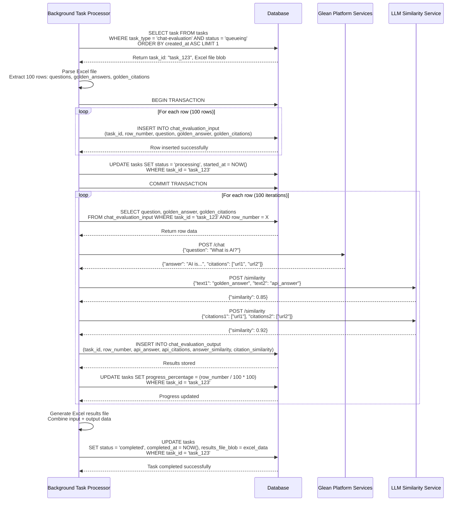
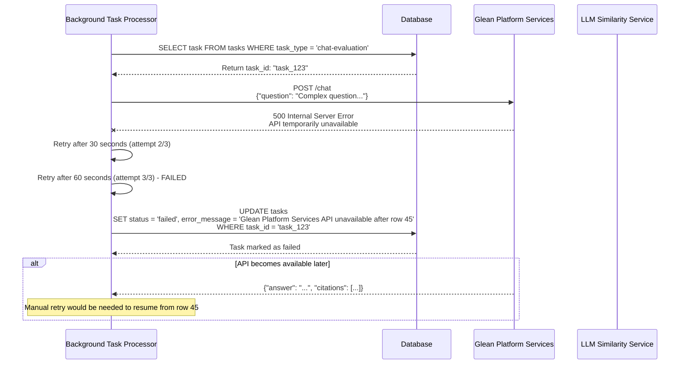

# Chat Evaluation Background Processing Sequence Diagram

## Chat Evaluation Processing Flow

### Success Flow - Complete Excel Processing

### Error Flow - API Failure During Processing

## Processing Characteristics

### Performance Metrics
- **Processing Rate**: ~10-15 rows per minute (depending on API response times)
- **Memory Usage**: Processes one row at a time to minimize memory footprint
- **Error Handling**: 3 retry attempts with exponential backoff
- **Progress Tracking**: Real-time progress updates per row
- **Transaction Safety**: Input data inserted in single transaction, results processed individually

### Data Flow Summary
1. **Task Selection**: FIFO queue processing of chat-evaluation tasks
2. **Excel Parsing**: Extract questions, golden answers, and citations  
3. **Bulk Insert**: Store all input data in chat_evaluation_input table
4. **Row Processing**: Sequential processing with API calls per row
5. **Results Storage**: Store API responses and similarity scores
6. **Progress Updates**: Update task progress percentage per row
7. **Final Assembly**: Generate Excel file with combined input/output data
8. **Completion**: Update task status and store results blob

### Error Recovery
- **API Failures**: Retry with exponential backoff (30s, 60s, 120s)
- **Partial Processing**: Resume from last successful row
- **Data Integrity**: Input data preserved even if processing fails  
- **Manual Recovery**: Failed tasks can be manually requeued
- **API Call Pattern**: 2 external API calls per row (Glean Platform Services + LLM Similarity)
