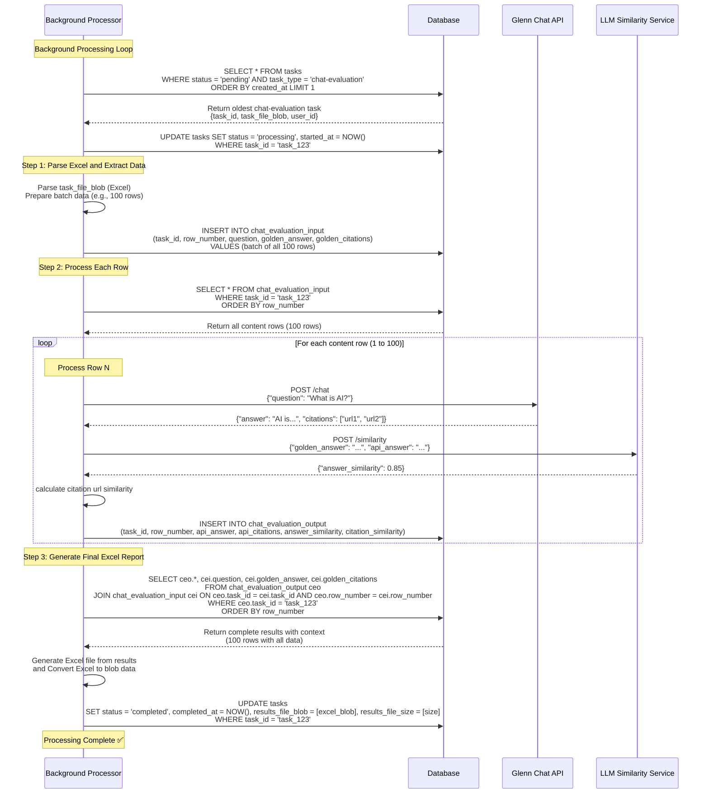
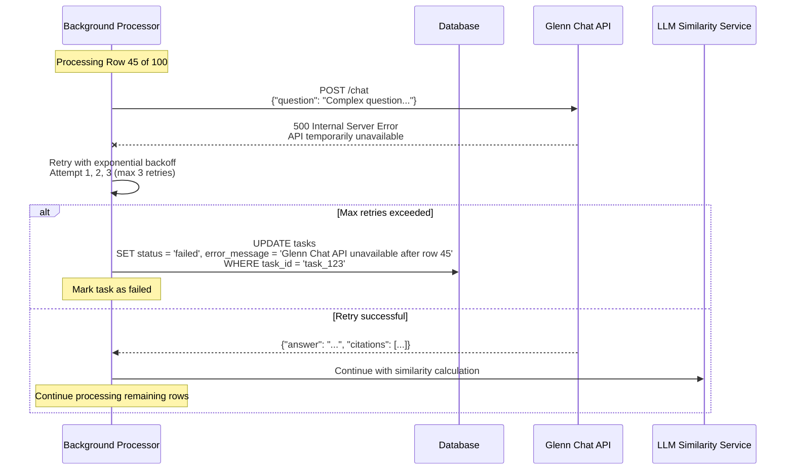
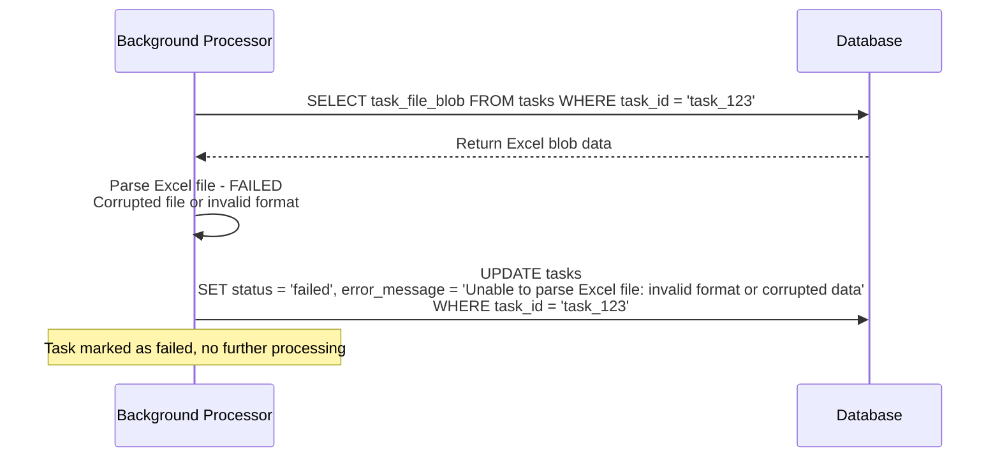

# Background Task Processing - Chat Evaluation

## Chat-Evaluation Processing Workflow

### Complete Processing Sequence for Chat-Evaluation Task Type

## Error Handling for Chat-Evaluation Processing

### API Failure During Row Processing

### Excel Parsing Failure

## Performance Characteristics

### Processing Metrics
- **Row Processing Rate**: ~5-10 rows per minute (depending on API response times)
- **API Call Pattern**: 2 external API calls per row (Glenn Chat + LLM Similarity)
- **Progress Updates**: Every 10 rows processed (to avoid excessive database updates)
- **Memory Usage**: Processes rows sequentially to avoid loading entire dataset

### Database Operations
- **Bulk Insert**: All content rows inserted in single transaction
- **Sequential Processing**: Results inserted one row at a time
- **Final Aggregation**: Single query to join content + results for Excel generation
