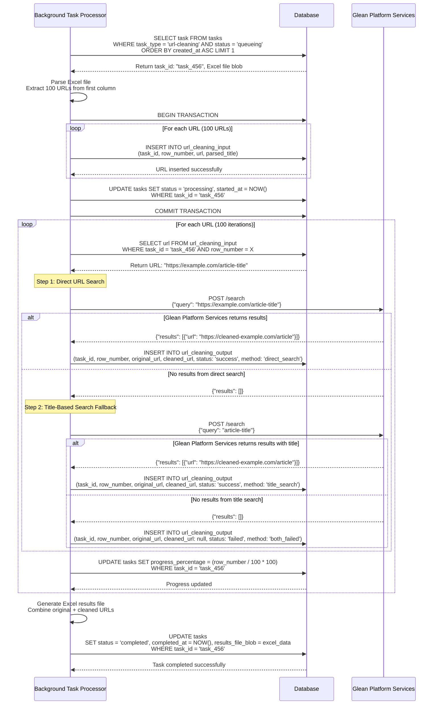
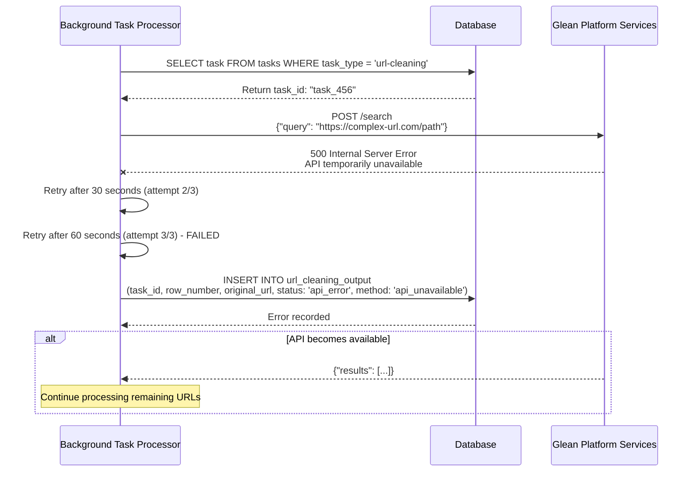
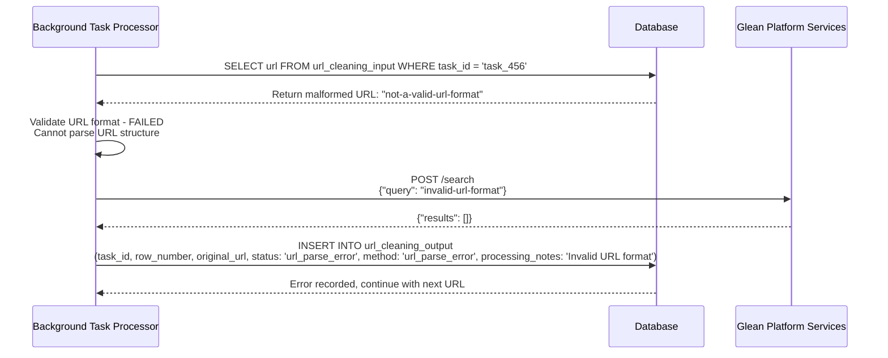

# URL Cleaning Background Processing Sequence Diagram

## URL Cleaning Processing Flow

### Success Flow - Complete URL Processing (100 URLs)

### Glean Platform Services API Failure

### URL Parsing Error

## Processing Characteristics

### Performance Metrics
- **Processing Rate**: ~20-30 URLs per minute (depending on Glean Platform Services response times)
- **Memory Usage**: Processes one URL at a time to minimize memory footprint
- **Error Handling**: 3 retry attempts with exponential backoff for API failures
- **Success Rate**: ~70-80% URLs successfully cleaned (depends on data quality)
- **URL Processing Rate**: ~10-20 URLs per minute (depending on Glean Platform Services response times)
- **API Call Pattern**: 1-2 Glean Platform Services calls per URL (direct search + optional title search)

### Data Flow Summary
1. **Task Selection**: FIFO queue processing of url-cleaning tasks
2. **Excel Parsing**: Extract URLs from first column of Excel file
3. **Bulk Insert**: Store all URLs in url_cleaning_input table
4. **URL Processing**: Sequential processing with search API calls per URL
5. **Two-Step Search**: Direct URL search followed by title-based search fallback
6. **Results Storage**: Store cleaned URLs, status, and processing method
7. **Progress Updates**: Update task progress percentage per URL
8. **Final Assembly**: Generate Excel file with original and cleaned URLs
9. **Completion**: Update task status and store results blob

### Error Recovery
- **API Failures**: Retry with exponential backoff, record as 'api_error' if all retries fail
- **URL Parse Errors**: Record as 'url_parse_error' and continue processing
- **Partial Processing**: Resume from last processed URL
- **Data Integrity**: Input URLs preserved even if cleaning fails
- **Manual Recovery**: Failed tasks can be manually requeued
- **Fallback Strategy**: Two-step search process (direct URL → title extraction)