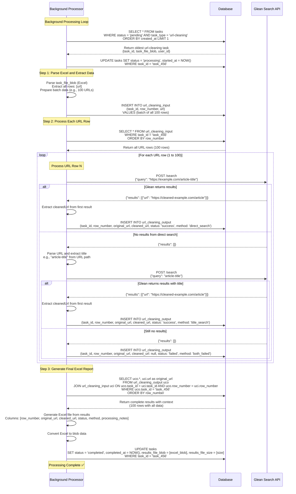
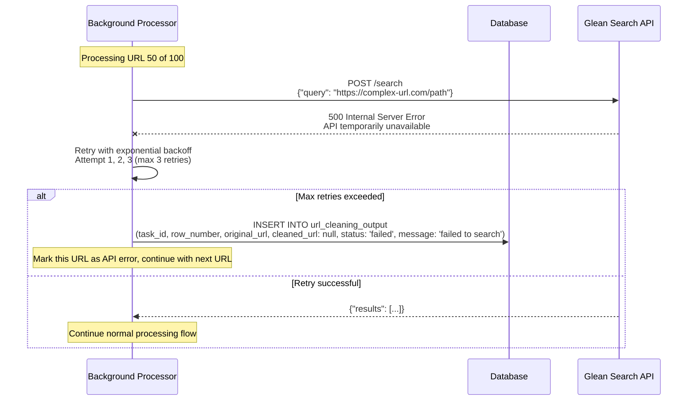
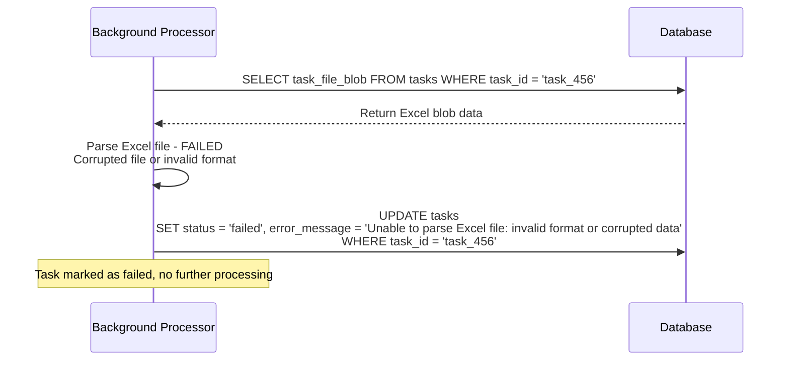
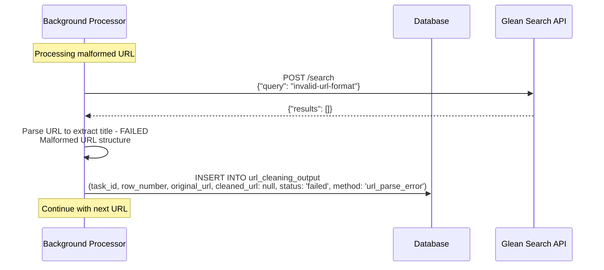

# Background Task Processing - URL Cleaning

## URL-Cleaning Processing Workflow

### Complete Processing Sequence for URL-Cleaning Task Type

## Error Handling for URL-Cleaning Processing

### Glean Search API Failure

### Excel Parsing Failure

### URL Parsing Error

## Performance Characteristics

### Processing Metrics
- **URL Processing Rate**: ~10-20 URLs per minute (depending on Glean API response times)
- **API Call Pattern**: 1-2 Glean Search API calls per URL (direct search + optional title search)
- **Fallback Strategy**: Two-step approach (direct URL search → title-based search)
- **Memory Usage**: Processes URLs sequentially to avoid loading entire dataset

### Database Operations
- **Bulk Insert**: All URL rows inserted in single batch operation
- **Sequential Processing**: Results inserted one URL at a time
- **Final Aggregation**: Single query to join URL data + results for Excel generation

### Success Rate Expectations
- **Direct Search Success**: ~60-70% of URLs cleaned on first attempt
- **Title Search Success**: ~20-25% additional URLs cleaned on second attempt  
- **Overall Success Rate**: ~80-90% of URLs successfully cleaned
- **Failure Cases**: Broken URLs, non-existent content, API limitations 