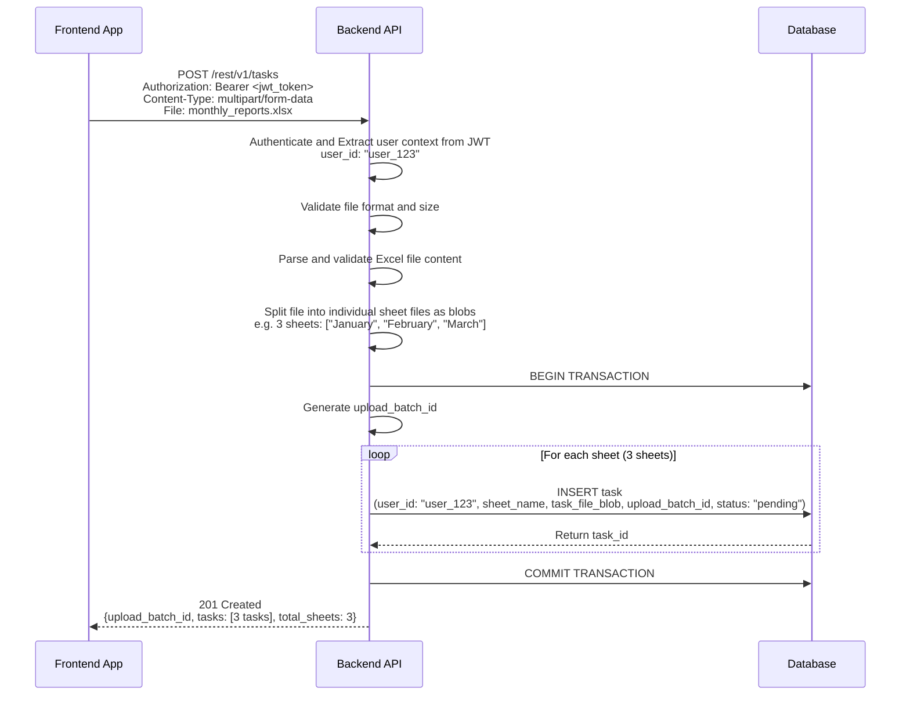
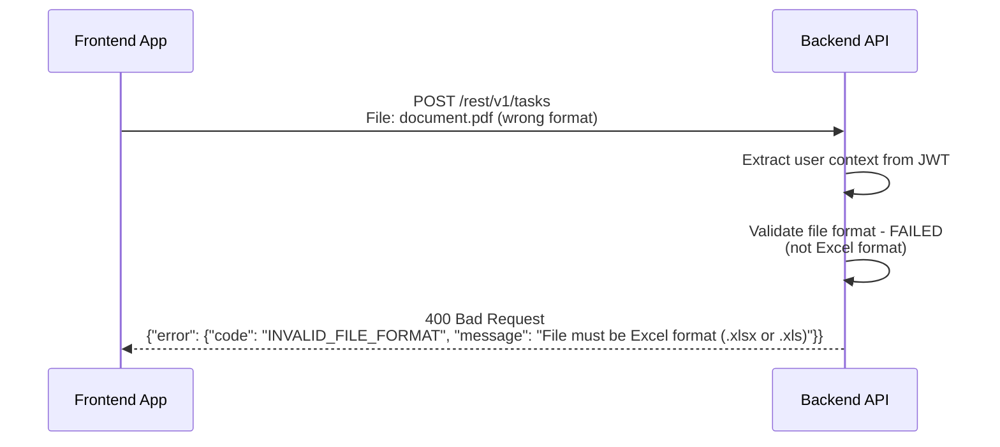
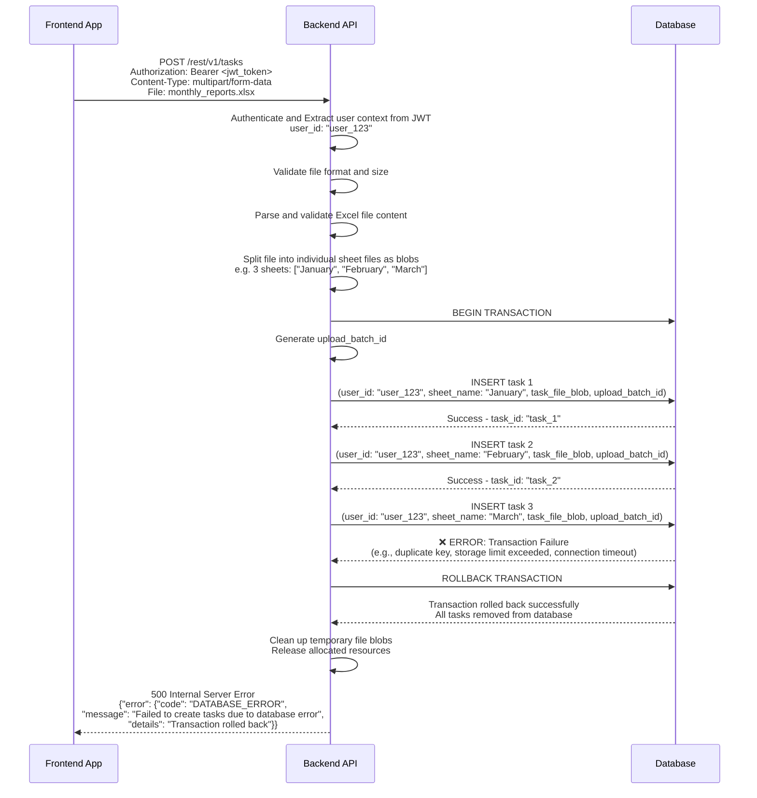
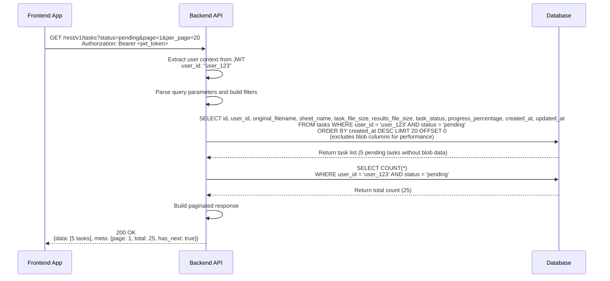
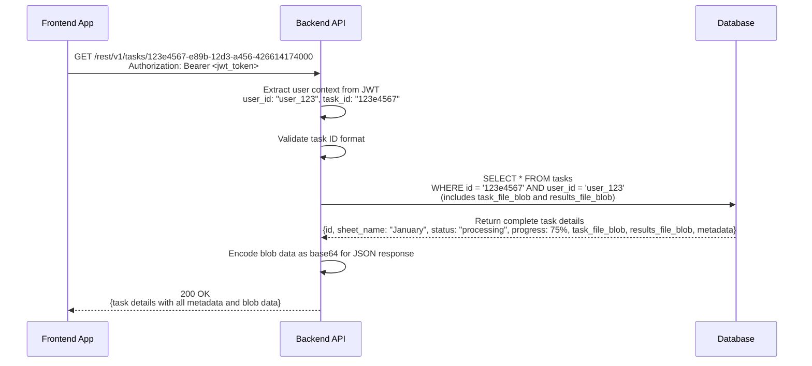
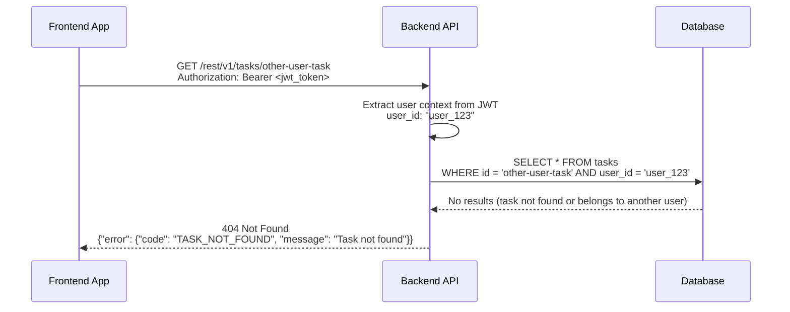
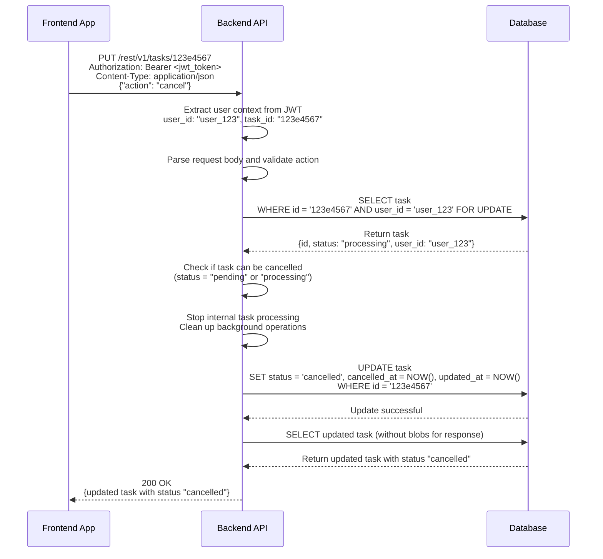
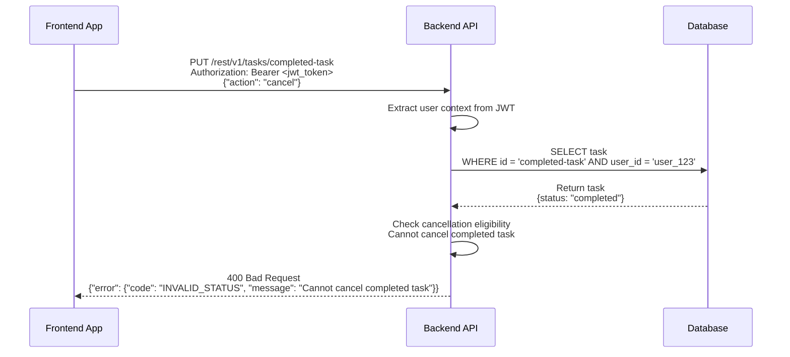
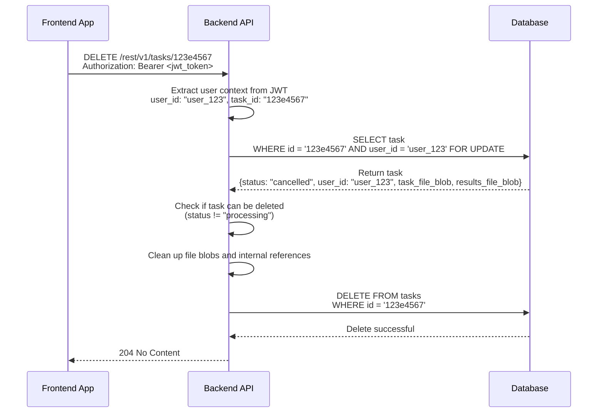
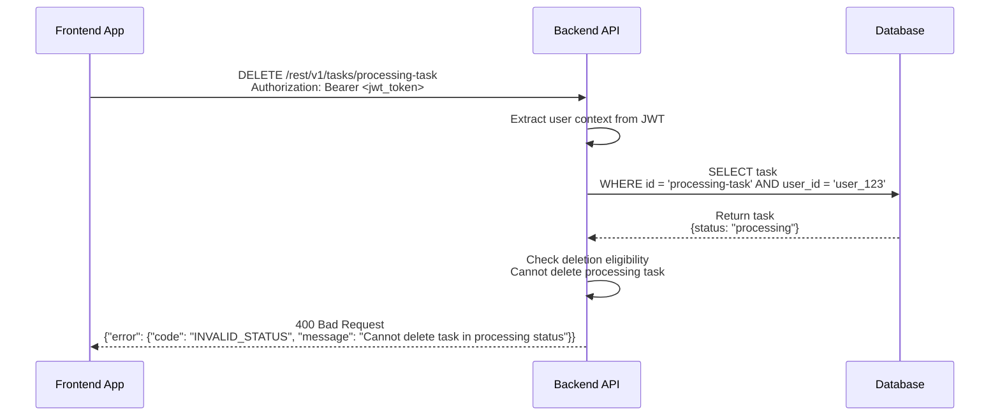

# Task Management API Request Handling Sequence Diagrams

This document contains sequence diagrams for the task management API endpoints, showing the interaction flow between frontend applications, API service, and database with simplified internal processing.

## Participants Legend
- **Frontend**: Internal frontend applications (Task Management UI)
- **API**: Main task management API service (handles all processing internally)
- **DB**: Primary Database (tasks and files)

## Endpoints 

| Method | Endpoint | Description | Auth Level |
|--------|----------|-------------|------------|
| POST   | `/rest/v1/tasks` | Upload Excel file and create tasks | User |
| GET    | `/rest/v1/tasks` | List user's tasks with filtering (no blob data) | User |
| GET    | `/rest/v1/tasks/{id}` | Get specific task details with blob files | User |
| PUT    | `/rest/v1/tasks/{id}` | Update/cancel a task | Owner |
| DELETE | `/rest/v1/tasks/{id}` | Delete a task | Owner |

## 1. POST /rest/v1/tasks - Excel File Upload and Task Creation

### Success Flow - Multi-Sheet Excel Upload

### Error Flow - Invalid Excel File

### Error Flow - Database Transaction Failure and Rollback

## 2. GET /rest/v1/tasks - List User Tasks (No Blob Data)

### Success Flow with Filtering

## 3. GET /rest/v1/tasks/{id} - Get Task Details with Blob Data

### Success Flow

### Error Flow - Task Not Found or Access Denied

## 4. PUT /rest/v1/tasks/{id} - Update/Cancel Task

### Success Flow - Cancel Task

### Error Flow - Cannot Cancel Completed Task

## 5. DELETE /rest/v1/tasks/{id} - Delete Task

### Success Flow

### Error Flow - Cannot Delete Processing Task

## Request/Response Flow Summary

### Key Features Demonstrated
- **RESTful Endpoints**: All endpoints follow `/rest/v1/` pattern with proper HTTP methods
- **JWT Authentication**: User context extraction and validation on every request
- **User Ownership**: Tasks are scoped to the authenticated user
- **Internal Processing**: All file parsing and task processing handled within the main API
- **Performance Optimization**: List endpoint excludes blob data, detail endpoint includes blobs
- **Error Handling**: Comprehensive error responses with proper HTTP status codes
- **Database Transactions**: Atomic operations for data consistency
- **File Management**: Blob storage and retrieval handled internally with separate fields for task and results

### Performance Characteristics
- **Optimized Listing**: GET /tasks excludes blob data for fast pagination
- **Complete Details**: GET /tasks/{id} includes all blob data for full task information
- **Simplified Architecture**: No external service dependencies
- **Direct Database Access**: Minimal latency for data operations
- **Internal File Processing**: No network overhead for file operations
- **Background Processing**: Non-blocking task execution with results storage
- **Efficient Querying**: Optimized database queries with proper indexing 